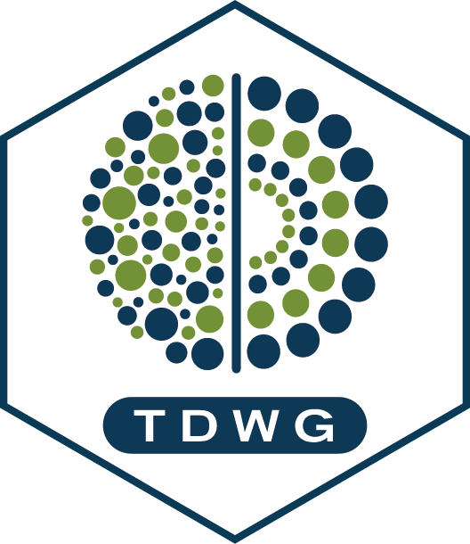

<!-- README.md is generated from README.Rmd. Please edit that file -->

# TDWG: cleaning occurrence records using the World Geographical Scheme for Recording Plant Distributions (WGSRPD) 

<!-- badges: start -->

`TDWG` [@TDWG] contains multiple functions to select or spatially filter occurrence records for plant species. It combines botanical information from hundreds of thousands of plant species from the Kew World Checklist of Vascular Plants (WCVP) [@WCVP] database, with geographical information derived from The International Working Group on Taxonomic Databases for Plant Sciences (TDWG) at approximately "country" level and upwards.\ 
The package was used to help identifying plants geographic ranges at broad scale and cleaning occurrence records for 36,687 distribution models in [*The global distribution of plants used by humans*](https://www.science.org/doi/10.1126/science.adg8028) [@UsefulPlants].\   


## *Installation*

Make sure to have [*R*](https://cloud.r-project.org/ "R") or [*Rstudio*](https://rstudio.com/products/rstudio/download/ "Rstudio") installed on your machine. Some R packages need to be compiled from source, so if you are on Windows, you need to install [*Rtools*](http://cran.r-project.org/bin/windows/Rtools/) too.\

Install *TDWG* with the following instructions:

``` r
devtools::install_github("IanOndo/TDWG")
library(TDWG)
```

## Important note
The package is currently using the 2022 version of the WCVP database, so no the lastest updates of the taxonomy. Current developments aim at incorporating functions from the R package [*rWCVP*](https://github.com/matildabrown/rWCVP) [@rwcvp].

## References

