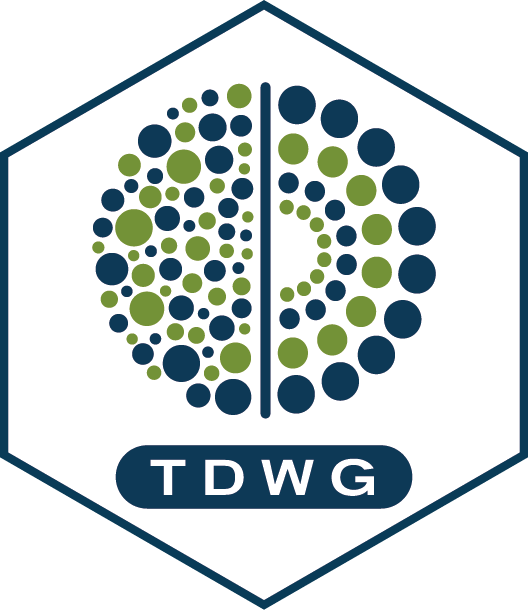

<!-- README.md is generated from README.Rmd. Please edit that file -->

# TDWG: cleaning occurrence records using the World Geographical Scheme for Recording Plant Distributions (WGSRPD) 

<!-- badges: start -->

# TDWG
